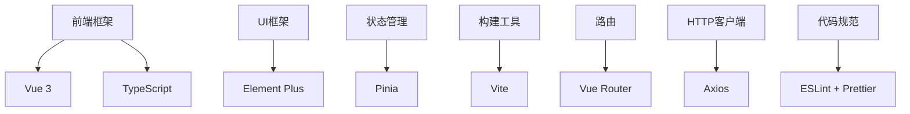
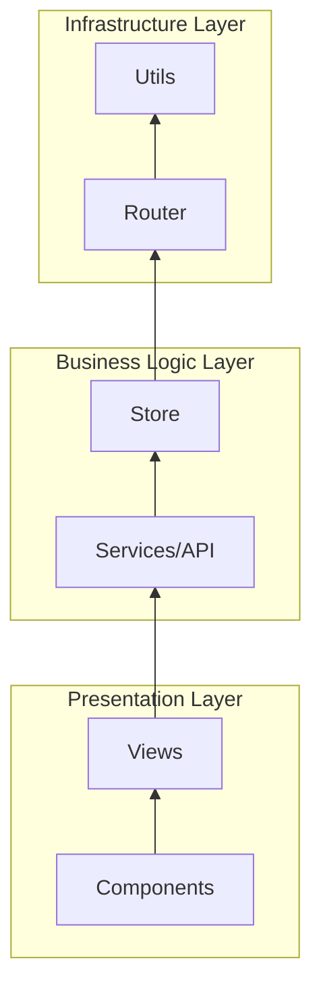
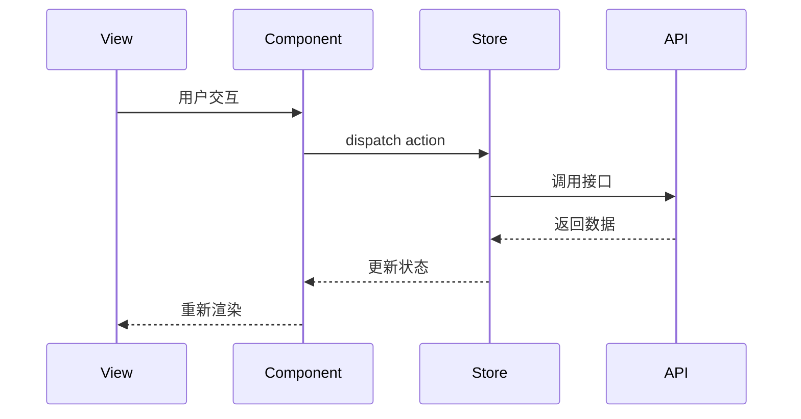
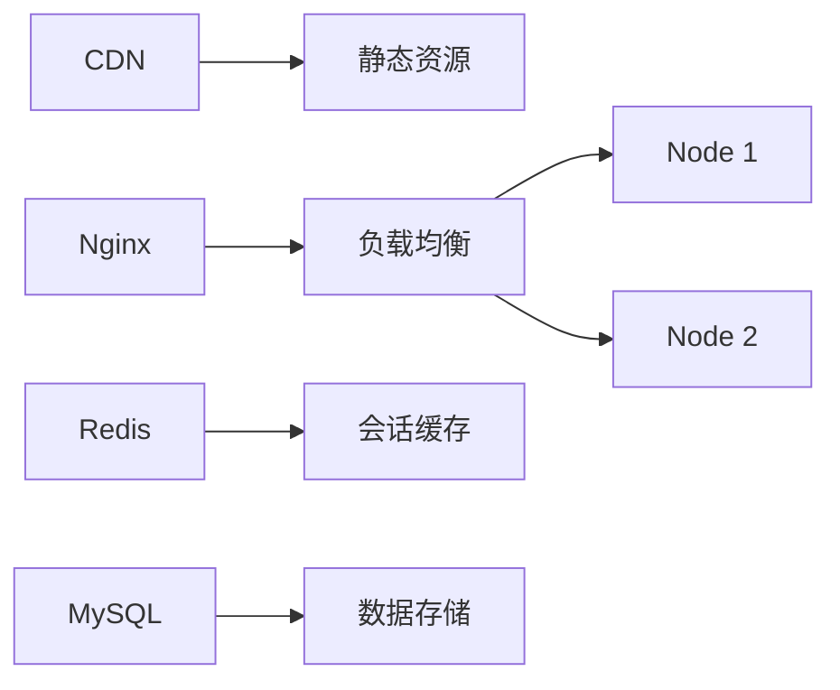

# 项目架构设计文档

## 1. 技术栈概览



## 2. 目录结构解析

```
zb-admin/
├── public/                # 静态资源
├── src/
│   ├── api/               # API请求封装
│   ├── assets/            # 静态资源
│   ├── components/        # 全局组件
│   ├── config/            # 全局配置
│   ├── hooks/             # 组合式函数
│   ├── icons/             # SVG图标
│   ├── layout/            # 布局组件
│   ├── mock/              # Mock数据
│   ├── plugins/           # 插件
│   ├── routers/           # 路由配置
│   ├── store/             # 状态管理
│   ├── styles/            # 全局样式
│   ├── utils/             # 工具函数
│   ├── views/             # 页面组件
│   ├── App.vue            # 根组件
│   └── main.ts            # 应用入口
├── .env.*                 # 环境变量
├── vite.config.ts         # Vite配置
└── tsconfig.json          # TypeScript配置
```

## 3. 核心架构设计

### 3.1 分层架构



### 3.2 数据流设计



## 4. 关键实现细节

### 4.1 请求封装 (src/api/request.ts)

```typescript
const service = axios.create({
  baseURL: import.meta.env.VITE_APP_BASE_API,
  timeout: 5000
})

// 请求拦截
service.interceptors.request.use(
  config => {
    if (store.getters.token) {
      config.headers['Authorization'] = `Bearer ${store.getters.token}`
    }
    return config
  },
  error => {
    return Promise.reject(error)
  }
)

// 响应拦截
service.interceptors.response.use(
  response => {
    const res = response.data
    if (res.code !== 200) {
      return Promise.reject(new Error(res.message || 'Error'))
    }
    return res
  },
  error => {
    return Promise.reject(error)
  }
)
```

### 4.2 路由配置 (src/routers/index.ts)

```typescript
const router = createRouter({
  history: createWebHashHistory(),
  routes: constantRoutes.concat(asyncRoutes)
})

// 路由守卫
router.beforeEach(async (to, from, next) => {
  // 设置页面标题
  document.title = to.meta.title || 'Admin'
  
  // 验证登录状态
  const hasToken = getToken()
  if (hasToken) {
    if (to.path === '/login') {
      next({ path: '/' })
    } else {
      next()
    }
  } else {
    if (whiteList.includes(to.path)) {
      next()
    } else {
      next(`/login?redirect=${to.path}`)
    }
  }
})
```

### 4.3 状态管理 (src/store/index.ts)

```typescript
export const useUserStore = defineStore('user', {
  state: () => ({
    token: getToken(),
    userInfo: null
  }),
  actions: {
    async login(userInfo) {
      const { data } = await login(userInfo)
      this.token = data.token
      setToken(data.token)
    },
    async getUserInfo() {
      const { data } = await getUserInfo()
      this.userInfo = data
    }
  }
})
```

## 5. 性能优化策略

### 5.1 代码分割

```typescript
// 动态导入组件
const UserManage = () => import('@/views/system/user/index.vue')
```

### 5.2 缓存策略

```typescript
// 使用keep-alive缓存页面
<router-view v-slot="{ Component }">
  <keep-alive :include="cachedViews">
    <component :is="Component" />
  </keep-alive>
</router-view>
```

### 5.3 按需加载

```typescript
// Element Plus按需导入
import { ElButton, ElInput } from 'element-plus'
app.use(ElButton).use(ElInput)
```

## 6. 安全设计

### 6.1 XSS防护

```typescript
// 使用DOMPurify过滤HTML
import DOMPurify from 'dompurify'
const clean = DOMPurify.sanitize(dirtyHTML)
```

### 6.2 CSRF防护

```typescript
// 设置CSRF Token
axios.defaults.headers.common['X-CSRF-TOKEN'] = getCSRFToken()
```

### 6.3 权限控制

```typescript
// 路由权限验证
function hasPermission(roles, route) {
  if (route.meta && route.meta.roles) {
    return roles.some(role => route.meta.roles.includes(role))
  }
  return true
}
```

## 7. 开发规范

### 7.1 命名约定

| 类型       | 命名规则          | 示例                |
|------------|-------------------|---------------------|
| 组件文件   | PascalCase        | UserForm.vue        |
| 工具函数   | camelCase         | formatDate.js       |
| 类型定义   | PascalCase        | UserModel.ts        |
| 常量       | UPPER_CASE        | API_URL             |

### 7.2 代码组织

```typescript
// 单文件组件结构
<script setup lang="ts">
// 1. 导入
import { ref } from 'vue'

// 2. 类型定义
interface Props {
  modelValue: string
}

// 3. Props定义
const props = defineProps<Props>()

// 4. 事件定义
const emit = defineEmits(['update:modelValue'])

// 5. 状态
const count = ref(0)

// 6. 计算属性
const doubled = computed(() => count.value * 2)

// 7. 方法
function increment() {
  count.value++
}

// 8. 生命周期
onMounted(() => {
  console.log('mounted')
})
</script>
```

## 8. 部署架构



## 9. 监控方案

### 9.1 前端监控

```typescript
// 使用Sentry捕获错误
import * as Sentry from '@sentry/vue'

Sentry.init({
  dsn: 'YOUR_DSN',
  integrations: [new Sentry.BrowserTracing()],
  tracesSampleRate: 1.0
})
```

### 9.2 性能监控

```javascript
// 使用web-vitals
import { getCLS, getFID, getLCP } from 'web-vitals'

getCLS(console.log)
getFID(console.log)
getLCP(console.log)
```

## 10. 未来演进

1. **微前端架构**: 使用qiankun实现模块化部署
2. **PWA支持**: 添加Service Worker实现离线可用
3. **WebAssembly**: 性能敏感模块使用Rust/WASM实现
4. **可视化搭建**: 基于JSON Schema的表单/页面生成器
### 6.2 CSRF防护

```typescript
// 设置CSRF Token
axios.defaults.headers.common['X-CSRF-TOKEN'] = getCSRFToken()
```

### 6.3 权限控制

```typescript
// 路由权限验证
function hasPermission(roles, route) {
  if (route.meta && route.meta.roles) {
    return roles.some(role => route.meta.roles.includes(role))
  }
  return true
}
```

## 7. 开发规范

### 7.1 命名约定

| 类型       | 命名规则          | 示例                |
|------------|-------------------|---------------------|
| 组件文件   | PascalCase        | UserForm.vue        |
| 工具函数   | camelCase         | formatDate.js       |
| 类型定义   | PascalCase        | UserModel.ts        |
| 常量       | UPPER_CASE        | API_URL             |

### 7.2 代码组织

```typescript
// 单文件组件结构
<script setup lang="ts">
// 1. 导入
import { ref } from 'vue'

// 2. 类型定义
interface Props {
  modelValue: string
}

// 3. Props定义
const props = defineProps<Props>()

// 4. 事件定义
const emit = defineEmits(['update:modelValue'])

// 5. 状态
const count = ref(0)

// 6. 计算属性
const doubled = computed(() => count.value * 2)

// 7. 方法
function increment() {
  count.value++
}

// 8. 生命周期
onMounted(() => {
  console.log('mounted')
})
</script>
```

## 8. 部署架构


## 9. 监控方案

### 9.1 前端监控

```typescript
// 使用Sentry捕获错误
import * as Sentry from '@sentry/vue'

Sentry.init({
  dsn: 'YOUR_DSN',
  integrations: [new Sentry.BrowserTracing()],
  tracesSampleRate: 1.0
})
```

### 9.2 性能监控

```javascript
// 使用web-vitals
import { getCLS, getFID, getLCP } from 'web-vitals'

getCLS(console.log)
getFID(console.log)
getLCP(console.log)
```

## 10. 未来演进

1. **微前端架构**: 使用qiankun实现模块化部署
2. **PWA支持**: 添加Service Worker实现离线可用
3. **WebAssembly**: 性能敏感模块使用Rust/WASM实现
4. **可视化搭建**: 基于JSON Schema的表单/页面生成器