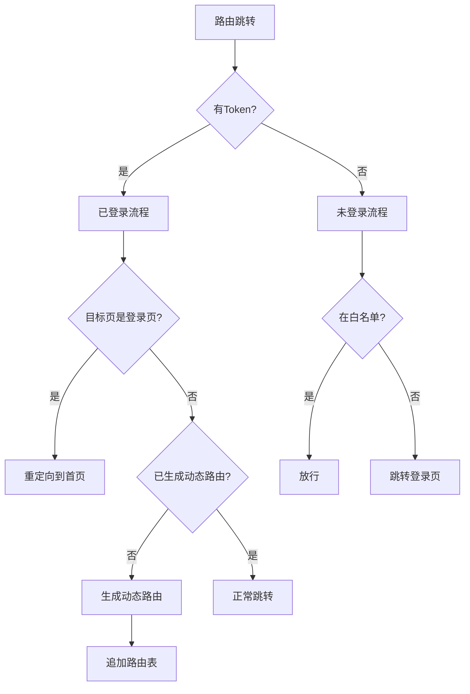

# 权限系统设计文档

## 1. 核心架构


## 2. 关键实现

### 2.1 路由守卫配置
位置：`src/permission.ts`
- 使用`router.beforeEach`全局守卫
- 白名单机制：`whiteList = ['/login']`
- 进度条集成：NProgress

### 2.2 动态路由生成
```typescript
// 核心代码逻辑
const accessRoutes = await PermissionStore.generateRoutes(UserStore.roles)
accessRoutes.forEach(item => router.addRoute(item))
```

### 2.3 状态管理
- 用户状态：`useUserStore` (token/roles)
- 权限状态：`usePermissionStore` (routes)

## 3. 权限配置规范
1. 路由元信息配置示例：
```js
{
  path: '/system',
  meta: {
    title: '系统管理',
    roles: ['admin'], // 可访问角色
    icon: 'setting'
  }
}
```

2. 角色定义：
- admin：超级管理员
- editor：内容编辑
- guest：访客

## 4. 异常处理
- Token失效：跳转登录页并携带redirect参数
- 权限不足：403页面处理
- 路由不存在：404页面处理