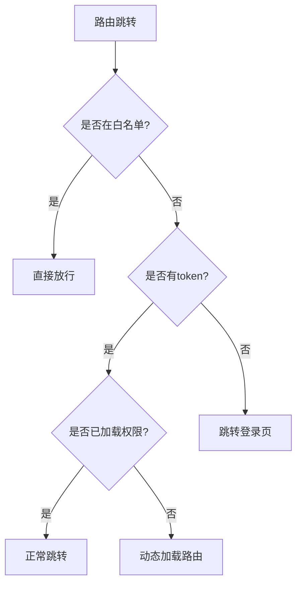

# 路由权限系统核心机制分析

## 1. 路由架构概述

本工程采用Vue Router实现的路由系统包含两大核心部分：
- **静态路由** (constantRoutes)：基础路由，如登录页、404页等
- **动态路由** (asyncRoutes)：根据用户权限动态加载的路由

## 2. 路由配置文件分析 (src/routers/index.ts)

### 2.1 路由类型定义
```typescript
interface extendRoute {
  hidden?: boolean
}
```

### 2.2 路由模块划分
- 按功能模块拆分为多个路由文件
- 通过扩展运算符合并为asyncRoutes

### 2.3 核心路由配置
```typescript
export const constantRoutes = [
  // 基础路由配置
  {
    path: '/login',
    component: () => import('@/views/login/index.vue'),
    hidden: true
  },
  // 布局路由
  {
    path: '/',
    component: Layout,
    redirect: '/home',
    children: [
      {
        path: '/home',
        component: () => import('@/views/home/index.vue'),
        meta: { title: '首页', role: ['other'] }
      }
    ]
  }
]
```

## 3. 权限控制流程 (src/permission.ts)

### 3.1 路由守卫工作流程


### 3.2 动态路由加载关键代码
```typescript
const accessRoutes = await PermissionStore.generateRoutes(UserStore.roles)
accessRoutes.forEach(item => router.addRoute(item))
```

## 4. 路由与权限Store的交互

权限控制涉及两个核心Store：
- **UserStore**：管理用户信息和token
- **PermissionStore**：管理路由权限和生成动态路由

## 5. 完整路由加载时序

1. 用户登录获取token和角色信息
2. 通过PermissionStore.generateRoutes生成有权限的路由
3. 使用router.addRoute动态添加路由
4. 路由跳转时通过beforeEach守卫验证权限
5. 权限不足时重定向到登录页或403页面

## 6. 关键设计亮点

1. **模块化路由配置**：按功能拆分路由模块
2. **动态权限控制**：基于用户角色过滤路由
3. **路由懒加载**：优化首屏性能
4. **元数据配置**：通过meta控制菜单和权限
5. **Hash模式**：兼容性更好的路由方案