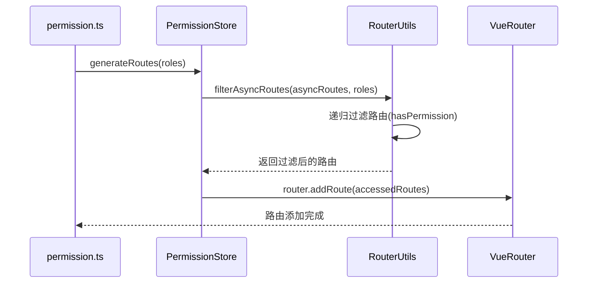

# 路由权限系统核心机制分析

## 1. 动态路由加载详细流程

### 1.1 权限验证核心逻辑

```typescript
// 权限验证方法 (src/utils/routers.ts)
export function hasPermission(roles, route) {
  if (route.meta && route.meta.roles) {
    return roles.some((role) => route.meta.roles.includes(role))
  }
  return false
}
```

### 1.2 路由过滤递归算法

```typescript
// 路由过滤方法 (src/utils/routers.ts)
export function filterAsyncRoutes(routes, roles) {
  const res = []
  routes.forEach((route) => {
    const tmp = { ...route }
    if (hasPermission(roles, tmp)) {
      if (tmp.children) {
        tmp.children = filterAsyncRoutes(tmp.children, roles)
      }
      res.push(tmp)
    }
  })
  return res
}
```

### 1.3 动态路由生成过程

```typescript
// 在permission store中 (src/store/modules/permission.ts)
generateRoutes(roles) {
  return new Promise((resolve) => {
    let accessedRoutes
    if (roles && roles.length && !roles.includes('admin')) {
      accessedRoutes = filterAsyncRoutes(asyncRoutes, roles)
    } else {
      accessedRoutes = asyncRoutes || []
    }
    accessedRoutes = accessedRoutes.concat(notFoundRouter)
    this.routes = constantRoutes.concat(accessedRoutes)
    this.addRoutes = accessedRoutes
    resolve(accessedRoutes)
  })
}
```

## 2. 动态路由加载时序图



## 3. 关键设计要点

1. **角色权限验证**：

   - 通过路由 meta.roles 定义所需角色
   - 使用 Array.some()验证用户是否具备任一所需角色

2. **路由过滤特点**：

   - 深度优先递归遍历路由树
   - 保留完整的路由结构
   - 浅拷贝路由对象避免污染原路由配置

3. **特殊处理**：

   - admin 角色拥有全部权限
   - 自动添加 404 路由
   - 合并静态路由和动态路由

4. **性能优化**：
   - 路由配置按模块拆分
   - 使用 Promise 异步处理
   - 路由懒加载

## 4. 完整工作流程

1. 用户登录获取角色信息
2. 调用 PermissionStore.generateRoutes
3. 根据角色过滤可访问路由
4. 合并基础路由和过滤后的动态路由
5. 通过 router.addRoute 动态注册路由
6. 路由跳转时进行权限校验
7. 权限不足时重定向到登录页或 403 页

## 总结

1. 路由架构设计采用模块化路由设计，按功能拆分到 modules 目录路由分为常量路由(constantRoutes)和异步路由(asyncRoutes) 使用 Vue Router 的 hash 模式(createWebHashHistory)
2. 权限控制流程登录验证：通过 token 验证用户登录状态角色过滤：根据用户角色过滤 asyncRoutes 动态添加：使用 router.addRoute 动态添加权限路由白名单机制：login 等页面无需权限
3. 核心实现路由守卫：src/permission.ts 处理全局路由拦截权限过滤：src/utils/routers.ts 实现路由递归过滤状态管理：使用 Pinia 管理路由状态(permissionStore)
4. 路由配置规范路由 meta 字段：title/icon/hidden/keepAlive 等懒加载：使用() => import()实现组件懒加载嵌套路由：通过 children 实现多级菜单
5. 特色功能路由缓存：通过 keepAlive 实现组件缓存动态标题：根据路由 meta 自动设置页面标题进度条：使用 NProgress 显示页面加载进度
