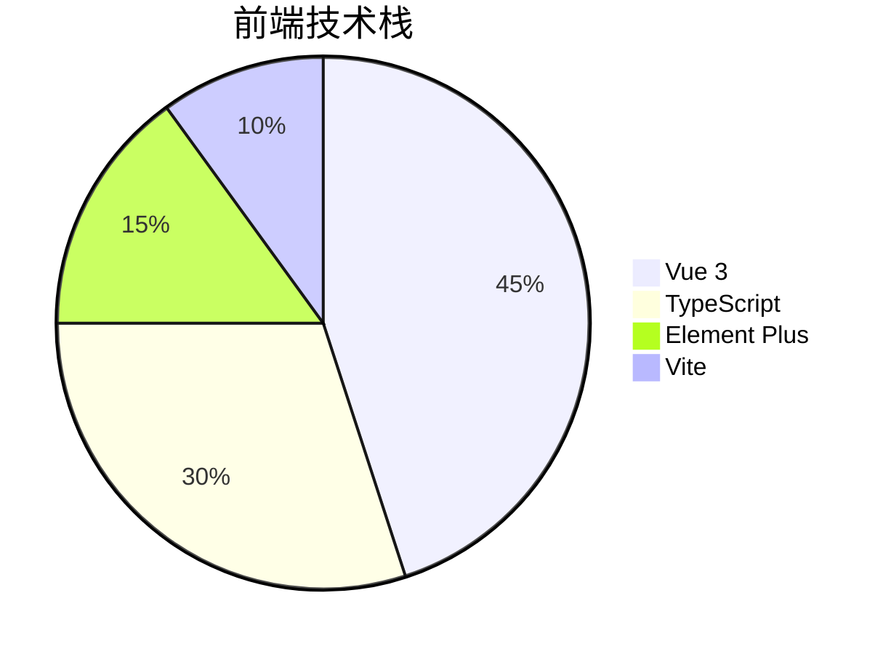

# 项目整体分析报告

## 1. 技术栈概览


### 核心依赖
```json
{
  "dependencies": {
    "vue": "^3.2.0",
    "vue-router": "^4.0.0",
    "pinia": "^2.0.0",
    "element-plus": "^2.0.0",
    "axios": "^0.27.0"
  },
  "devDependencies": {
    "vite": "^3.0.0",
    "typescript": "^4.6.0",
    "eslint": "^8.0.0"
  }
}
```

## 2. 目录结构解析
```
zb-admin/
├── public/            # 静态资源
├── src/
│   ├── api/           # 接口封装
│   ├── assets/        # 静态资源
│   ├── components/    # 公共组件
│   ├── config/        # 全局配置
│   ├── hooks/         # 组合式函数
│   ├── layout/        # 布局组件
│   ├── router/        # 路由配置
│   ├── store/         # 状态管理
│   ├── utils/         # 工具函数
│   └── views/         # 页面视图
├── docs/              # 项目文档
└── vite.config.ts     # 构建配置
```

## 3. 开发规范

### 代码风格
- 组件命名：PascalCase (如 `UserAvatar.vue`)
- 变量命名：camelCase
- 常量命名：UPPER_CASE

### Git提交规范
```bash
<type>(<scope>): <subject>
# 示例
feat(login): 添加手机号登录功能
fix(router): 修复路由重定向问题
```

## 4. 构建与部署

### 开发模式
```bash
pnpm dev
```

### 生产构建
```bash
pnpm build
```

### Docker部署示例
```dockerfile
FROM nginx:alpine
COPY dist /usr/share/nginx/html
EXPOSE 80
CMD ["nginx", "-g", "daemon off;"]
```

## 5. 架构亮点

1. **动态路由加载**  
   基于用户角色动态生成可访问路由

2. **请求拦截统一处理**  
   封装axios实现：
   - 自动Token注入
   - 错误统一提示
   - 响应数据格式化

3. **组件化设计**  
   高复用组件：
   - `SvgIcon` SVG图标组件
   - `RightClickMenu` 右键菜单
   - `WangEditor` 富文本编辑器

4. **主题切换系统**  
   支持light/dark模式无缝切换