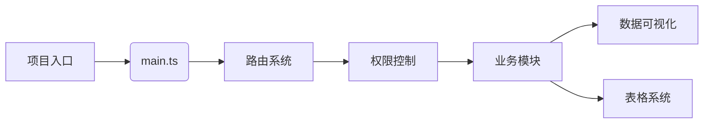

# 项目文档总览

## 1. 项目概览
- [PROJECT_ANALYSIS.md](./PROJECT_ANALYSIS.md) - 项目整体分析
- [ARCHITECTURE.md](./guide/ARCHITECTURE.md) - 系统架构设计

## 2. 核心模块
- [CORE_MODULES_ANALYSIS.md](./CORE_MODULES_ANALYSIS.md) - 核心业务模块分析
- [CORE_LOGIC_ANALYSIS.md](./CORE_LOGIC_ANALYSIS.md) - 核心业务逻辑
- [VIEWS_ANALYSIS.md](./VIEWS_ANALYSIS.md) - 视图层分析

## 3. 开发指南
- [API.md](./guide/API.md) - 接口规范
- [ROUTER.md](./guide/ROUTER.md) - 路由配置
- [COMPONENTS.md](./guide/COMPONENTS.md) - 组件规范
- [PERMISSION.md](./guide/PERMISSION.md) - 权限系统

## 4. 快速导航


## 5. 最佳实践
1. **组件开发**
```bash
# 创建新组件模板
npm run gen:component ComponentName
```

2. **API调用**
```typescript
import { getUserInfo } from '@/api/user'

// 标准调用方式
const { data } = await getUserInfo(params)
```

3. **样式规范**
```scss
/* src/styles/variables.scss */
$--color-primary: #409EFF;
$--border-radius: 4px;
```

## 6. 扩展阅读
- [Axios配置](./AxiosRequestConfig.md)
- [ElementUI主题](./guide/THEME.md)